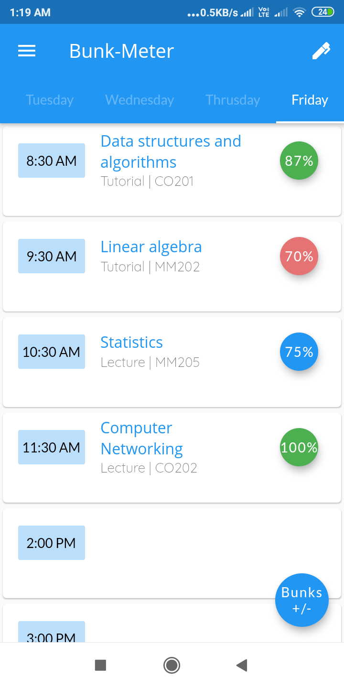
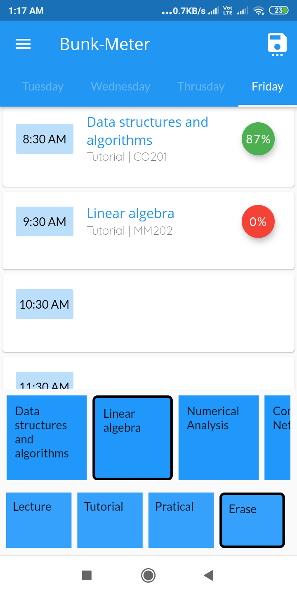
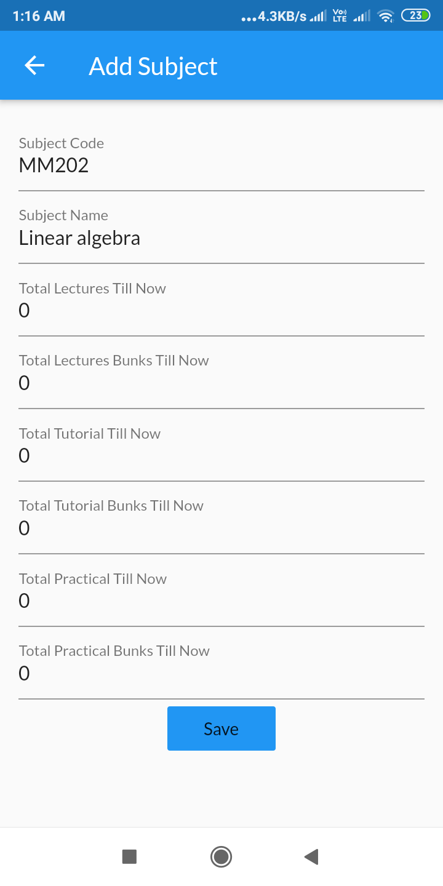
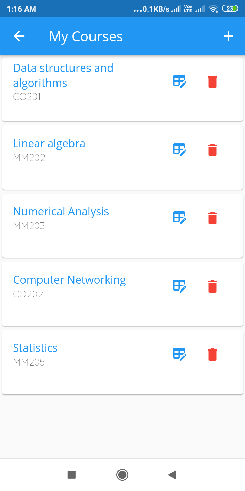
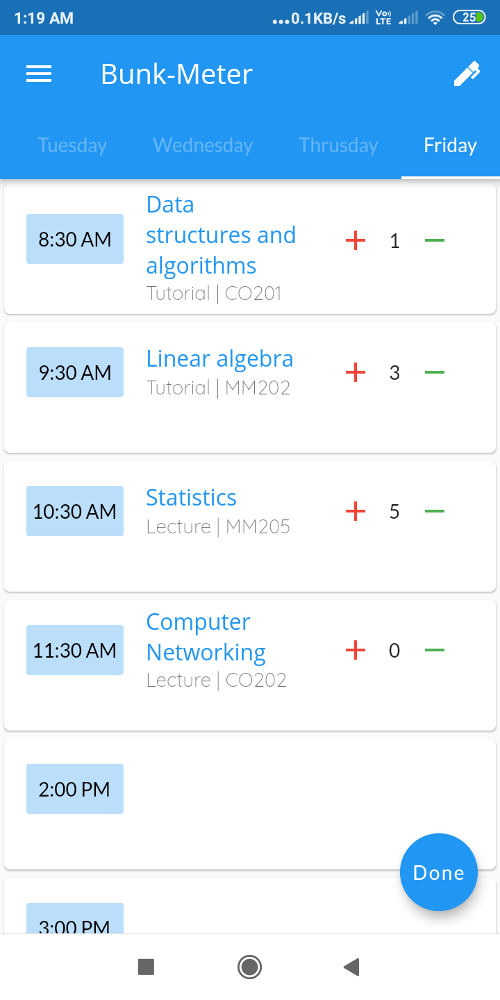
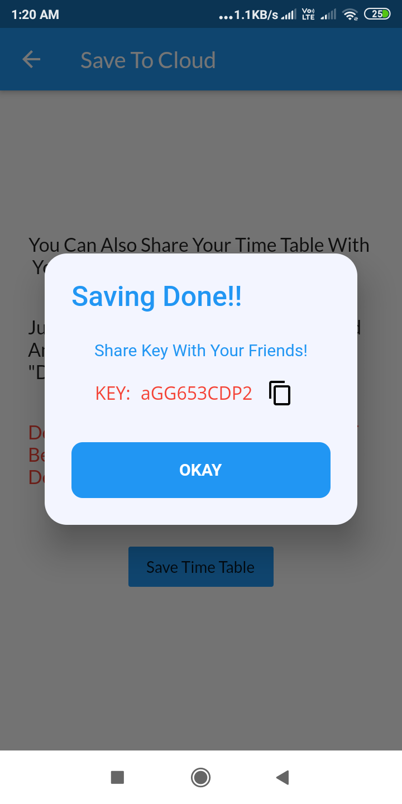
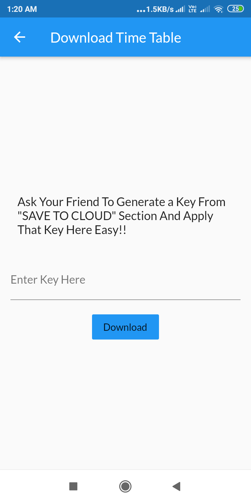
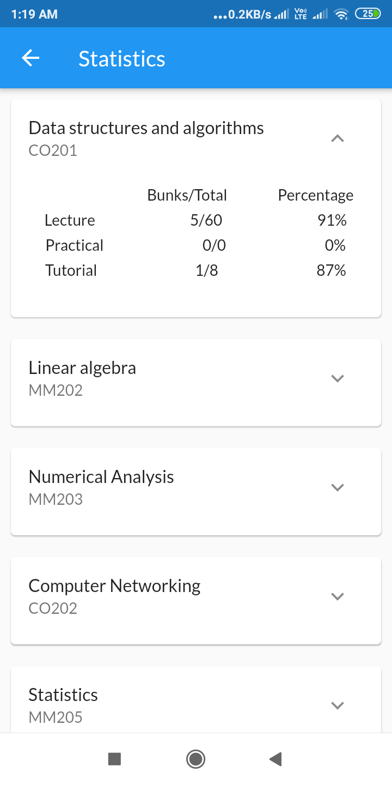
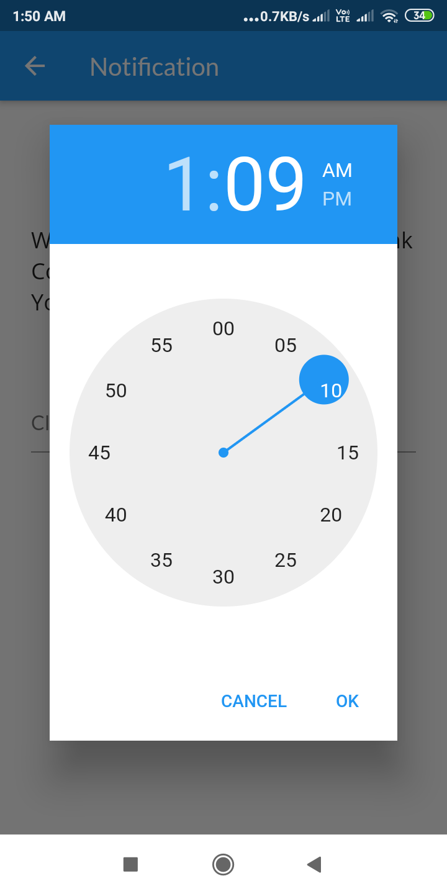

# Bunk-Meter

Mobile Appication that will keep track on the bunks.
## Features

### View And Edit Your TimeTable
             
### Edit Courses
          
### Edit Bunks

### Save Timetable to Decentralized Network

### Share Your TimeTable With Peers

### View Bunk Statistics

### Automatically Incrementing of Daily Lectures

### Receive Notifications

## Built With

- [Flutter SDK](https://flutter.dev/) - Mobile App Development kit
- [MoiBit Decentralized stroage](https://www.moibit.io/?promocode=moibit) - For Decentralized Storage
- [Firebase](https://firebase.google.com/) - For Authentication 
- [SQLite Database](https://www.sqlite.org/index.html) - Storing Data Locally

# Getting Started

This project is a starting point for a Flutter application.

A few resources to get you started if this is your first Flutter project:

- [Lab: Write your first Flutter app](https://flutter.dev/docs/get-started/codelab)
- [Cookbook: Useful Flutter samples](https://flutter.dev/docs/cookbook)

For help getting started with Flutter, view our
[online documentation](https://flutter.dev/docs), which offers tutorials,
samples, guidance on mobile development, and a full API reference.

## Installing

1. Clone the repo `$ git clone https://github.com/itsmihir/bunk-meter.git``
2. Login to Moibit.io and get API key and paste that key in /provider/database.dart files.
3. Register app From Firebase.
2. run command "flutter run"

## Authors

- **Mihir Khambhati** - [itsmihir](https://github.com/itsmihir)
